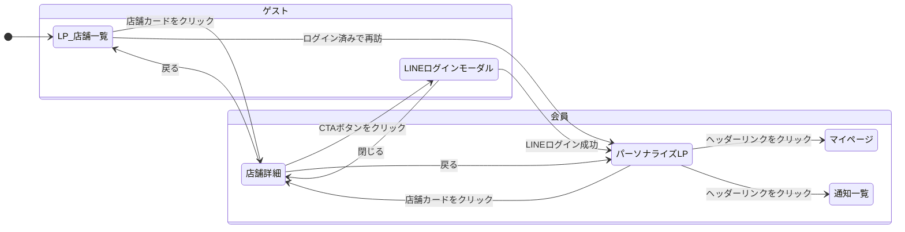

# 画面遷移図と状態管理仕様書

## 1. 目的

本ドキュメントは、「段階的エンゲージメント」モデルにおけるユーザーの状態と、それに伴う画面の遷移を定義します。これにより、開発チームはセッション管理やUIの動的な変更を正確に実装することができます。

## 2. ユーザー状態の定義

| 状態 | 識別方法 | 永続化 | 説明 |
| :--- | :--- | :--- | :--- |
| **ゲスト** | セッションIDのみ存在 | セッションCookie | ログインしておらず、LINEのユーザーIDが紐付いていない状態。 |
| **会員** | セッションIDとLINEユーザーIDが紐付いている | セッションCookie + DB | LINEログインを完了し、データベースにユーザー情報が保存されている状態。 |

## 3. 画面遷移図

この図は、ユーザーのアクションによってどの画面からどの画面へ遷移するかを示します。

## 4. 状態管理とUIの動的変更

サーバーサイドは、リクエストごとにセッションをチェックし、ユーザーが「ゲスト」か「会員」かを判断します。その結果に応じて、フロントエンドに返すデータやUIの表示を動的に変更します。

### LP / 店舗一覧ページ

-   **IF** ユーザー状態が **会員** THEN
    -   ヘッダーに「通知」「マイページ」リンクを表示する。
    -   店舗一覧の上部に「パーソナライズエリア」を表示し、おすすめ店舗や新着オファーのデータを渡す。
-   **ELSE** (ユーザー状態が **ゲスト**)
    -   ヘッダーはロゴのみ表示する。
    -   「パーソナライズエリア」は表示しない。

### 店舗詳細ページ

-   **IF** ユーザー状態が **ゲスト** THEN
    -   CTAボタン（「仮面接を受けてみる」など）をクリックすると、「LINEログインモーダル」を表示するイベントを発火させる。
-   **ELSE** (ユーザー状態が **会員**)
    -   CTAボタンをクリックすると、直接「仮面接申し込みAPI」や「オファー送信API」を叩くイベントを発火させる。

### セッション管理

-   ユーザーがサイトに初めてアクセスした際、サーバーはユニークなセッションIDを生成し、HTTP Cookieとしてクライアントに送信します。
-   ユーザーがLINEログインに成功すると、サーバーはセッションIDにLINEユーザーIDを紐付けてデータベースに保存します。
-   以降、クライアントからのリクエストに含まれるセッションIDを基に、サーバーはユーザーが「ゲスト」か「会員」かを判断します。
