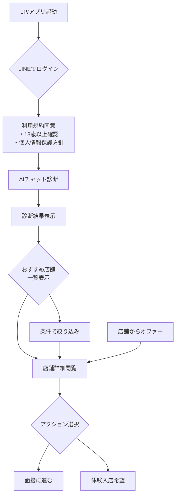
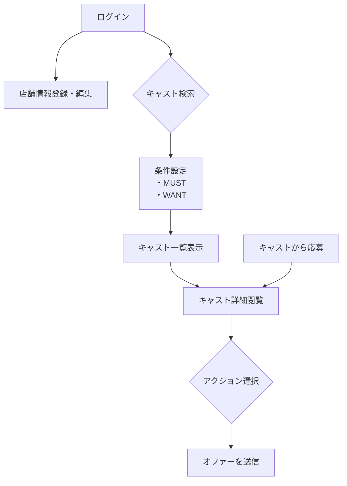

# キャバクラ面接アプリ ユーザーフロー

## 1. はじめに

本ドキュメントは、提供されたフローチャート画像に基づき、「キャバクラ面接アプリ」の主要なユーザーフローを明確化し、再定義するものです。ユーザーを「キャスト（女の子）」と「店舗（店長）」の2種類に大別し、それぞれの体験の流れをステップバイステップで解説します。

## 2. キャスト（女の子）のユーザーフロー

キャスト（女の子）は、自分に合ったお店を見つけるために、AI診断を通じて自身の適性を把握し、最適な店舗とマッチングすることを目指します。

| ステップ | アクション | 詳細 |
| :--- | :--- | :--- |
| **1. 新規登録・ログイン** | SNSアカウント（LINEを推奨）でログインし、利用規約に同意する。 | 18歳以上であることの確認と、個人情報取得への許諾が必須です。 |
| **2. AI診断** | AIチャットボットと対話し、いくつかの質問に答える。 | この診断結果に基づき、ユーザーの「ランク」や「タイプ」が判定され、マッチングの精度向上に利用されます。 |
| **3. 店舗検索・閲覧** | 診断結果に基づき、おすすめの店舗一覧を閲覧する。 | ジャンル（例：熟女・セクシー系、ラウンジ、ガールズバー）や条件で店舗を絞り込むことも可能です。 |
| **4. マッチング・応募** | 気になる店舗の詳細情報を確認し、「面接に進む」または「体験入店を希望する」アクションを起こす。 | 店舗側から「オファー」を受け取ることもあります。 |
| **5. 面接・採用** | 店舗と直接コミュニケーションを取り、面接の日程調整などを行います。 | 最終的に、自分に合った店舗のリストを手に入れ、採用に至ることを目指します。 |

### キャスト向けフロー図

## 3. 店舗（店長）のユーザーフロー

店舗（店長）は、お店の求める条件に合った優秀なキャスト（女の子）を効率的に探し、採用することを目指します。

| ステップ | アクション | 詳細 |
| :--- | :--- | :--- |
| **1. 店舗情報登録** | 募集要項、待遇、お店の雰囲気など、詳細な店舗情報を登録する。 | この情報がキャストへのアピール材料となります。登録が前提条件です。 |
| **2. キャスト検索** | 登録されているキャストのリストを閲覧し、条件で検索する。 | 「MUST（必須）」と「WANT（希望）」の条件を設定し、候補者を絞り込みます。 |
| **3. プロフィール確認** | 気になるキャストのプロフィール詳細（ランク、経歴、自己PRなど）を確認する。 | 他の店舗が興味を示しているキャストも閲覧可能です。 |
| **4. オファー送信** | 採用したいキャストに「オファー」を送信し、アプローチする。 | キャストからの「面接希望」に応える形でコミュニケーションを開始することもあります。 |
| **5. 面接・採用** | キャストと直接コミュニケーションを取り、面接を実施し、採用を決定する。 | 効率的に優秀な人材を確保することがゴールです。 |

### 店舗向けフロー図

