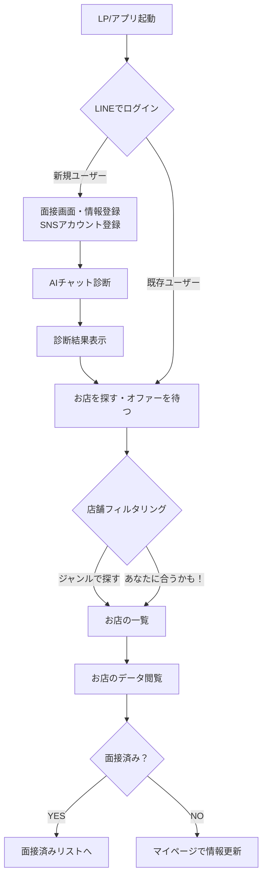
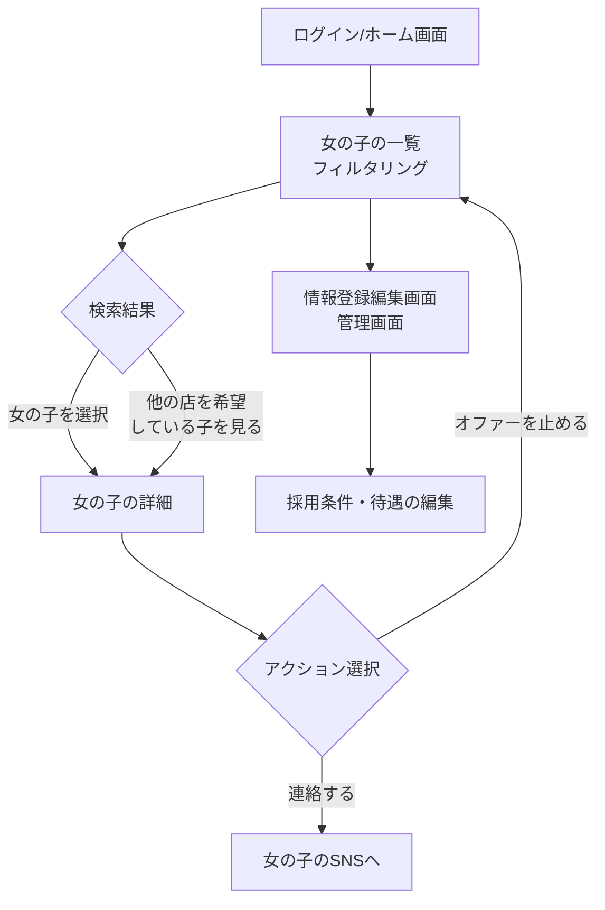

# キャバクラ面接アプリ ユーザーフロー（修正版）

## 1. はじめに

本ドキュメントは、提供された高解像度のフローチャート画像に基づき、「キャバクラ面接アプリ」のユーザーフローをより正確に再定義するものです。ユーザーを「キャスト（女の子）」と「店舗（店長）」の2種類に大別し、それぞれの体験の流れを詳細に解説します。

## 2. キャスト（女の子）のユーザーフロー

キャストは、自分に合ったお店を効率的に見つけるため、AI診断や詳細なフィルタリングを通じて最適な店舗とのマッチングを目指します。

| ステップ | アクション | 詳細 |
| :--- | :--- | :--- |
| **1. 新規登録・ログイン** | LINEアカウントでログインし、利用規約に同意する。 | 18歳以上であることの確認と、個人情報取得への許諾が必須です。初回登録時には、面接画面で情報登録とSNSアカウント登録を行います。 |
| **2. AI診断** | AIチャットボットと対話し、いくつかの質問に答える。 | この診断結果に基づき、ユーザーの「ランク」や「タイプ」が判定され、マッチングの精度向上に利用されます。診断後、条件に合うお店やアカウントに条件が通知されます。 |
| **3. 店舗検索・閲覧** | 「あなたに合うかも！」というレコメンドや、ジャンル（熟女・セクシー、ラウンジ等）で店舗をフィルタリングする。 | 「お店のデータ」から詳細を確認したり、「人気なお店の一覧」を閲覧することも可能です。 |
| **4. マッチング・応募** | 気になる店舗の詳細情報を確認し、「面接済み」としてマークするか、マイページで情報を更新する。 | 店舗側から「オファー」を受け取ることもあります。アピールポイント（生配信での売上額、指名本数など）も確認できます。 |
| **5. 任意情報登録** | 任意入力フォームから、身分証、プロフィール画像、在籍情報URLなどを登録する。 | これらの情報は、より精度の高いマッチングや店舗へのアピールに繋がります。 |

### キャスト向けフロー図（修正版）

## 3. 店舗（店長）のユーザーフロー

店舗は、お店の求める条件に合った優秀なキャストを効率的に探し、採用することを目指します。

| ステップ | アクション | 詳細 |
| :--- | :--- | :--- |
| **1. 店舗情報登録** | 募集要項、採用条件、待遇など、詳細な店舗情報を登録する。 | この情報がキャストへのアピール材料となります。情報の登録がサービスの利用前提です。 |
| **2. キャスト検索** | 「女の子の一覧」から、フィルタリング機能を使ってキャストを検索する。 | 「他の店を希望している女の子」の情報を閲覧することも可能です。 |
| **3. プロフィール確認** | 「女の子の詳細」画面で、希望している条件やSNSアカウントを確認する。 | 「MUST（必須）」と「WANT（希望）」の条件でマッチング結果が表示されます。 |
| **4. オファー・連絡** | 採用したいキャストに「オファー」を送信したり、SNSアカウントを通じて直接連絡を取る。 | 「条件通知」や「情報を更新する」といったアクションも可能です。 |
| **5. 採用管理** | 「情報登録編集画面・管理画面」で、応募者情報や選考状況を一元管理する。 | 「ケース1: 原石の女子大生『ヒナちゃん』」のような具体的な判定例も参考にします。 |

### 店舗向けフロー図（修正版）

