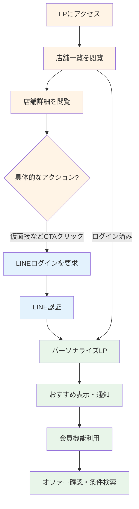

# キャバクラ面接アプリ ユーザーフロー（v3 - 段階的エンゲージメントモデル）

## 1. はじめに

本ドキュメントは、ユーザーからのヒアリングに基づき、本アプリの核心的な体験である「段階的エンゲージメント」モデルを反映したユーザーフローを定義します。このモデルは、ユーザーのログインへの心理的ハードルを最小限に抑え、興味・関心の度合いに応じて自然な形で登録へと導くことを目的とします。

## 2. 3つのユーザー状態

本システムのユーザー体験は、以下の3つの状態によって管理されます。

| 状態 | 説明 | 主な目的 |
| :--- | :--- | :--- |
| **1. 未認証ユーザー（ゲスト）** | ログインしていない、初めてサイトを訪れたユーザー。 | 豊富な店舗情報を自由に閲覧させ、サービスの魅力を伝える。 |
| **2. ログイン移行ユーザー** | サービスに興味を持ち、具体的なアクションを起こそうとしているユーザー。 | LINEログインを促し、スムーズな会員登録を完了させる。 |
| **3. 認証済みユーザー（会員）** | LINEログインを完了し、パーソナライズされた機能を利用できるユーザー。 | 最適なマッチングを提供し、エンゲージメントを高める。 |

## 3. ユーザーフロー詳細

### 状態1: 未認証ユーザー（ゲスト）のフロー

ゲストユーザーは、登録なしでサービスの価値を体験できます。

1.  **LP（店舗一覧）へアクセス**: ユーザーはまず、全ての店舗情報が掲載されたランディングページにアクセスします。
2.  **自由な店舗閲覧**: 検索やフィルタリング機能は使わず、豊富な店舗リストを自由にスクロールして閲覧します。
3.  **店舗詳細の確認**: 気になる店舗をクリックすると、その詳細ページへ遷移します。
4.  **アクションの喚起**: 店舗詳細ページには、「仮面接を受けてみる」「オファーを送る」といった具体的なアクションを促すボタン（CTA）が設置されています。

### 状態2: ログイン移行フロー

ゲストユーザーが具体的なアクションを起こすと、ログインが促されます。

1.  **CTAクリック**: ゲストユーザーが「仮面接を受けてみる」などのCTAボタンをクリックします。
2.  **LINEログイン画面の表示**: LINEログインを促すモーダルウィンドウやページが表示されます。
3.  **認証と登録**: ユーザーがLINEで認証を行うと、システムはLINEのユーザーIDを取得し、それを基に新規アカウントを作成します。セッションが開始され、ユーザーは「認証済み」状態に移行します。

### 状態3: 認証済みユーザー（会員）のフロー

ログイン後のユーザーは、パーソナライズされた体験を享受します。

1.  **パーソナライズされたLP**: ログイン後、LPのトップには「あなたの条件に合うお店」といった、AI診断結果や過去の行動に基づいたおすすめ店舗が表示されます。
2.  **通知機能**: 新しいオファーが届くと、ヘッダーなどに通知が表示され、すぐに確認できます。
3.  **全機能へのアクセス**: 「オファーを待つ」「条件で探す」といった、会員専用の全ての機能が利用可能になります。
4.  **セッション維持**: 一度ログインすれば、ブラウザを閉じない限りセッションは維持され、再訪時には自動的にログイン状態となります。

### 全体フロー図（段階的エンゲージメントモデル）

